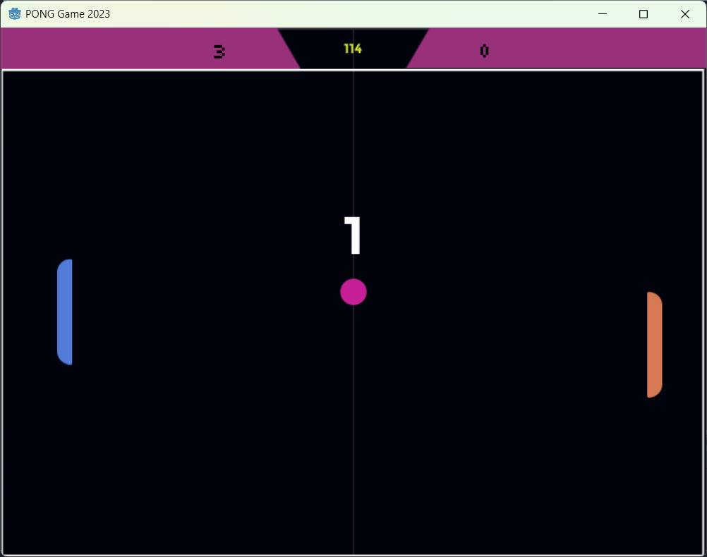

# pong-game-godot-engine

For our Godot Engine lab

Godot v3.5.2

Assets used:
- https://myebstudios.itch.io/simple-ping-pong-assets

update :
V0.1
- sound added
- timeout for game resuming

V0.2
- losing player gets to serve the ball

